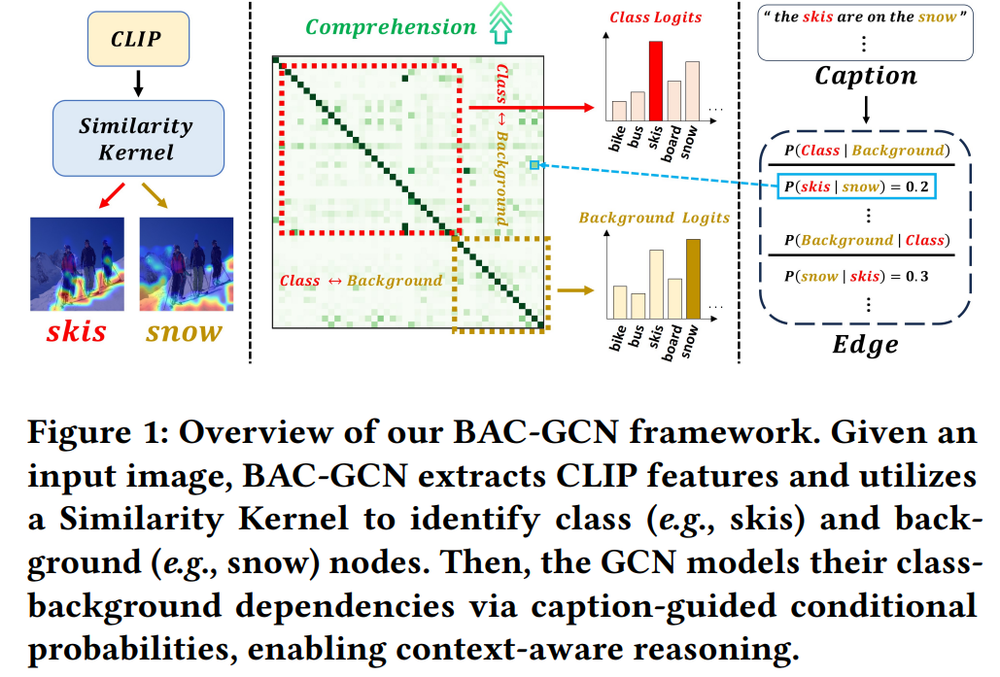

<div align="center">

# Official implementation of the paper "BAC-GCN: Background-Aware CLIP-GCN Framework for Unsupervised Multi-Label Classification"<br>[ACM MM '25]

[](https://doi.org/10.1145/3746027.3755253)
[](https://yonghyeonjo46.github.io/BAC-GCN/)
[](https://arxiv.org/abs/)
<!--[](https://arxiv.org/abs/)-->


</div>
This is an official implementation of the ACM Multimedia paper "Official implementation of the paper "BAC-GCN: Background-Aware CLIP-GCN Framework for Unsupervised Multi-Label Classification"

<br> 
<br> 

<div align="center">
  
</div>

## Abstract

Multi-label classification has recently demonstrated promising performance through CLIP-based unsupervised learning. However, existing CLIP-based approaches primarily focus on object-centric features, which limits their ability to capture rich contextual dependencies between objects and their surrounding scenes. In addition, the vision transformer architecture of CLIP exhibits a bias toward the most prominent object, often failing to recognize small or less conspicuous objects precisely. To address these limitations, we propose Background-Aware CLIP-GCN (BAC-GCN), a novel framework that explicitly models class-background interactions and is designed to capture fine-grained visual patterns of small objects effectively. BAC-GCN is composed of three key components: (i) a Similarity Kernel that extracts patch-level local features for each category (i.e., class and background), (ii) a CLIP-GCN that captures relational dependencies between local-global and class-background features, and (iii) a Re-Training for Small Objects (ReSO) strategy that enhances the representation of small and hard-to-learn objects by learning their distinctive visual characteristics. Therefore, our method facilitates a deeper understanding of complex visual contexts, enabling the model to make decisions by leveraging diverse visual cues and their contextual relationships. Extensive experiments demonstrate that BAC-GCN achieves state-of-the-art performance on three benchmark multi-label datasets: VOC07, COCO, and NUS, validating the effectiveness of our approach.

## Introduction

<!-- <div align="center">
  
</div> -->


<div align="center">
  
</div>
<br> 
In this paper, we propose Background-Aware CLIP-GCN (BAC-GCN), a novel framework that enhances multi-label classification by capturing fine-grained and context-aware visual patterns.
Accordingly, the proposed framework is carefully designed to leverage not only class (\eg, \textit{skis}) but also background (\eg, \textit{snow}) information to achieve a deeper understanding of contextual relationships.
Specifically, our approach aims to enhance object-level discrimination by introducing a Similarity Kernel that analyzes local patches to extract diverse and discriminative visual cues from complex scenes.
We also utilize a Large Language Model (LLM)~\cite{li2023blip} to generate image captions and employ CLIP to extract local, global, class-specific, and background features.
The generated captions and extracted features generate multi-modal features to help our network understand the global context and incorporate background knowledge together.
The multi-modal features are then integrated into a Graph Convolutional Network (GCN), which explicitly models relational dependencies between object classes and backgrounds to enhance contextual reasoning capabilities.
Furthermore, we propose a Re-training for Small Objects (ReSO) strategy to enhance recognition of small and hard-to-learn objects.
We identify such objects through a similarity map derived from patch-level features and selectively re-train them to reinforce fine-grained representation learning.

## Results

<div style="display: flex; justify-content: center; gap: 10px;">
  
  
</div>

<br> 
<br> 

<div align="center">
  
</div>


<!--
## YouTube
<div align="center">

<a href="https://www.youtube.com/watch?v=SnWqZ_lb93Y"></a>

</div>
-->

## How to run

### Create Environment

You can build the environment by following the instruction below.

```bash
git clone https://github.com/yonghyeonjo46/BAC-GCN.git
cd BAC-GCN

conda create -n bac python=3.9
conda activate bac

pip install torch==1.9.0+cu111 torchvision==0.10.0+cu111 -f https://download.pytorch.org/whl/torch_stable.html

pip install -r requirements.txt
```

### Prepare Dataset

Please download the datasets from the original sources. Then, please place them as below.

```
data/
├── coco2014/
│   ├── train2014
│   └── val2014
├── voc2007/
│   ├── VOCtrainval_06-Nov-2007
│   └── VOCtest_06-Nov-2007
├── voc2012/
│   ├── VOC2012_test
│   └── VOC2012_train_val
└── nuswide/
    ├── Flickr
    └── ImageList
```


### Prepare Training Resources

* The pseudo-labels were generated by [**LAVIS**](https://github.com/salesforce/LAVIS).
* Please download the caption files from [**here**] and place them as shown below.
```
caption/
├── coco2014/
│   ├── coco2014_captions.json
│   └── coco2014_re_captions.json
├── voc2007/
│   ├── voc2007_captions.json
│   └── voc2007_re_captions.json
├── voc2012/
│   ├── voc2012_captions.json
│   └── voc2012_re_captions.json
└── nuswide/
    ├── nuswide_captions.json
    └── nuswide_re_captions.json
```
* Please download CLIP pre-trained [**ViT-B/16**](https://openaipublic.azureedge.net/clip/models/5806e77cd80f8b59890b7e101eabd078d9fb84e6937f9e85e4ecb61988df416f/ViT-B-16.pt) and put it to `/local_root/pretrained_models/clip`.
* Please download the images detected during the ReSO process from [**here**].


### Run 4-Step Filter Process

```bash
# For COCO2014
python caption.py --dataset coco2014

# For VOC2012
python caption.py --dataset voc2012
```

### Train

```bash
# For COCO2014
python train_c14.py --val_img_root data/coco2014/images/val2014/ --val_split_file ./imageset/coco2014/val_cls.txt --train_img_root data_folder/coco2014/images/train2014/ --train_split_file ./imageset/coco2014/train_cls.txt --model_path ./pretrained_models/clip/ViT-B-16.pt --dataset coco2014

# For VOC2012
python train_v12.py --val_img_root data/voc2012/images/val2014/ --val_split_file ./imageset/voc2007/val_cls.txt --train_img_root data_folder/voc2007/images/train2014/ --train_split_file ./imageset/voc2007/train_cls.txt --model_path ./pretrained_models/clip/ViT-B-16.pt --dataset voc2012
```


## Results

| Method | VOC2007 | VOC2012 | COCO2014 | NUSWIDE |
| --- | --- | --- | --- | --- | 
| CDUL | 89.0 | 88.6 | 69.2 | 44.0 |
| TagCLIP | 92.8 | - | 68.8 | 35.0 |
| BAC-GCN (paper) | **93.0** | **93.2** | **72.2** | **48.8** |

## Acknowledgement

This repo benefits from [TagCLIP](https://github.com/linyq2117/TagCLIP), [TaI-DPT](https://github.com/guozix/TaI-DPT), [CLIP](https://github.com/openai/CLIP). Thanks for their wonderful works.

## Citation
```
@InProceedings{yhj25_mm,
    author    = {Yonghyeon Jo, Janghyun Kim, Jinsun Park},
    title     = {BAC-GCN: Background-Aware CLIP-GCN Framework for Unsupervised Multi-Label Classification},
    booktitle = {Proceedings of the 33st ACM International Conference on Multimedia},
    year         = {2025},
    pages     = {28515-28524}
}
```
<!--
## Acknowledgement

Our implementation is based on the following works. We greatly appreciate all these excellent works.

+ [AaD](https://github.com/Albert0147/AaD_SFDA)
+ [Lightning Hydra Template](https://github.com/ashleve/lightning-hydra-template)
+ [Transfer Learning Library](https://github.com/thuml/Transfer-Learning-Library)
+ [DDA](https://github.com/moskomule/dda)

## Citation


-->

